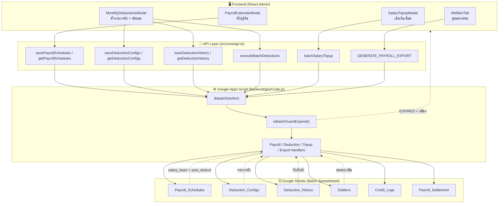
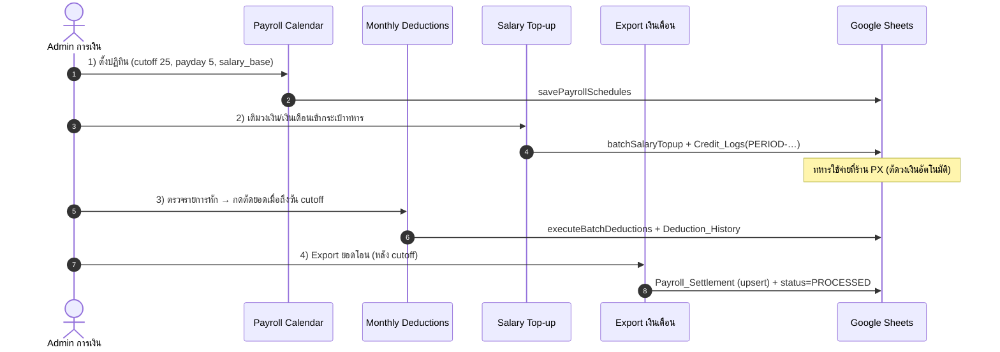
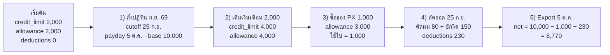
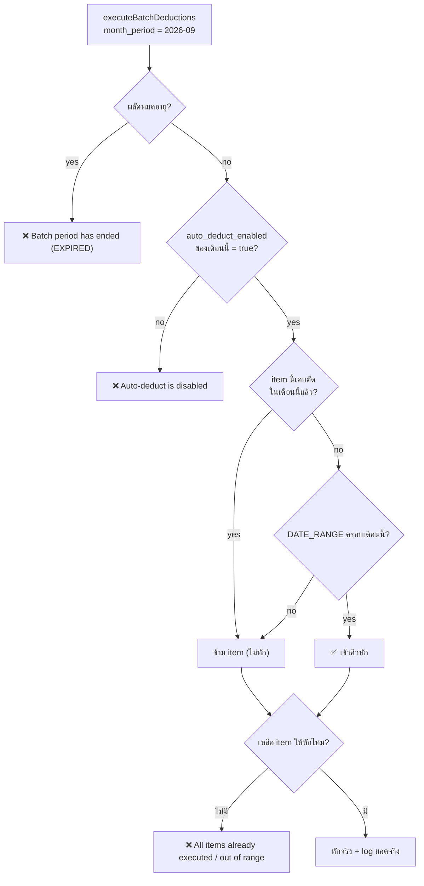
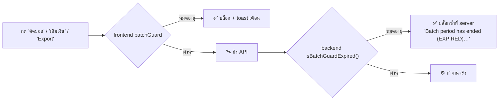

# 📘 คู่มือใช้งาน & ไหลข้อมูล: ปฏิทินเงินเดือน • หักเงินประจำเดือน • เติมเงินเดือน

> **ขอบเขตเอกสาร:** ระบบ 3 ส่วนที่ทำงานร่วมกันในแอดมิน PX กองบิน 21
> 1. **Payroll Calendar** — ปฏิทินวันเงินเดือนเข้า + วันตัดยอดหักเงิน
> 2. **Monthly Deductions** — ตั้งรายการหัก + ตัดยอดหักเงินประจำเดือน
> 3. **Salary Top-up** — เติมเงินเดือน / เบี้ยเลี้ยง เข้ากระเป๋าทหาร
>
> **ออกแบบเพื่อ:** ให้ผู้ดูแลระบบ (Admin การเงิน) และนักพัฒนาอ่านแล้วเข้าใจการไหลของข้อมูลได้ใน 10 นาที

---

## 🧭 1. หลักการสำคัญที่สุด (อ่านก่อน!)

| หลักการ | ความหมาย |
|---|---|
| **Server = Source of Truth** | ปฏิทิน, รายการหัก, ประวัติการหัก เก็บใน **Google Sheets** ทั้งหมด → เปิดเครื่องไหน เบราว์เซอร์ไหน ก็เห็นข้อมูลเดียวกัน |
| **localStorage = อดีต** | เดิมเก็บในเครื่อง (หายข้ามเครื่อง) ตอนนี้เหลือไว้แค่ "ย้ายข้อมูลครั้งเดียว" (auto-migrate) |
| **รันซ้ำได้ไม่พัง (Idempotent)** | Export เงินเดือนและตัดยอดหัก รันซ้ำไม่เกิดข้อมูลซ้ำ/หักซ้ำ |
| **frontend + backend ตรวจเหมือนกัน** | UI บล็อกผลัดหมดอายุ **และ** GAS ก็ตรวจซ้ำ (กันการยิง API ตรง) |
| **ทุกการหัก/เติม มี Audit Log** | เขียนลง `Credit_Logs` ทุกครั้ง ตรวจย้อนหลังได้รายคน รายเดือน |

---

## 🏗️ 2. แผนผังระบบโดยรวม



**อ่านแบบเข้าใจง่าย:**
- Frontend **ไม่เก็บข้อมูลเอง** → ยิงไป GAS ทุกครั้งที่เปิดหน้าจอ
- GAS ตรวจ 2 ชั้น: `isBatchGuardExpired()` (ผลัดหมดอายุ) → แล้วค่อยเข้าตัว handler
- handler อ่าน "ค่าตั้งต้น" จาก `Payroll_Schedules` + `Deduction_Configs` + `Deduction_History` แล้วเขียนผลลัพธ์ลง `Soldiers` / `Credit_Logs` / `Payroll_Settlement`

---

## 🗄️ 3. ตารางฐานข้อมูล (ตารางใหม่ 3 ตัว)

สร้างใน **Batch Spreadsheet** ของแต่ละผลัดโดยอัตโนมัติ (ชื่อชีต `ชื่อตาราง_รหัสผลัด`)

### 3.1 `Payroll_Schedules` — ปฏิทินเงินเดือน

| คอลัมน์ | ชนิด | ความหมาย | ตัวอย่าง |
|---|---|---|---|
| `month_key` | string | รอบเดือน (PK) | `2026-09` |
| `month_label` | string | ชื่อเดือนไทย | `กันยายน 2569` |
| `payday_date` | date | วันเงินเดือนเข้า (เดือนถัดไป) | `2026-10-05` |
| `cutoff_date` | date | วันตัดยอดหักเงิน | `2026-09-25` |
| `salary_base` | number | ฐานเงินเดือนต่อคน | `10000` |
| `auto_deduct_enabled` | boolean | เปิดหักอัตโนมัติรอบนี้ไหม | `TRUE` |
| `status` | enum | สถานะรอบ | `SCHEDULED` / `CUTOFF_REACHED` / `PROCESSED` / `PAST` |

### 3.2 `Deduction_Configs` — รายการหักที่ตั้งไว้

| คอลัมน์ | ชนิด | ความหมาย |
|---|---|---|
| `config_key` | string | คงที่ = `items` |
| `config_json` | JSON | อาร์เรย์รายการหักทั้งชุด |
| `updated_at` | ISO string | เวลาแก้ล่าสุด |

ตัวอย่าง `config_json`:
```json
[
  { "id":"ded_haircut","name":"ค่าตัดผมประจำเดือน","amount":80,"category":"HAIRCUT",
    "schedule_type":"MONTHLY_RECURRING","target_wallet":"SALARY","is_enabled":true },
  { "id":"ded_mess","name":"ค่าอาหารโรงเลี้ยง","amount":600,"category":"MESS_HALL",
    "schedule_type":"DATE_RANGE","target_wallet":"SALARY","is_enabled":true,
    "start_date":"2026-09-01","end_date":"2026-11-30" },
  { "id":"ded_gear","name":"ค่าเครื่องแบบแรกเข้า","amount":350,"category":"GEAR",
    "schedule_type":"ONE_TIME","target_wallet":"SALARY","is_enabled":true }
]
```

### 3.3 `Deduction_History` — ประวัติการตัดยอด (Audit)

| คอลัมน์ | ความหมาย |
|---|---|
| `record_id` | รหัสประวัติ (PK) |
| `month_period` | รอบที่ตัด (`2026-09`) |
| `month_label` | ชื่อเดือน |
| `executed_at` | เวลาที่ตัด |
| `executed_by_id` / `executed_by_name` | ผู้ทำรายการ |
| `target_soldier_count` | จำนวนทหารที่ถูกหัก |
| `total_deduction_amount` | ยอดรวมทั้งผลัด |
| `per_soldier_amount` | ยอดหักต่อคน |
| `salary_deductions` / `allowance_deductions` / `cash_deductions` | ยอดแยกตามกระเป๋า |
| `items_snapshot_json` | **สำเนารายการหัก ณ เวลาที่ตัด** (ใช้กันหักซ้ำ) |
| `status` | `COMPLETED` |

### 3.4 ตารางเดิมที่เกี่ยวข้อง (ทบทวน)

- **`Soldiers`**: `px_code, national_id, full_name, unit, credit_limit, deductions, credit_allowance_balance, cash_wallet_balance, photo_url, status`
- **`Credit_Logs`**: `log_id, px_code, txn_type, wallet_type, amount, balance_before, balance_after, ref_order_id, recorded_by, timestamp`
  - `ref_order_id` เก็บ `PERIOD-2026-09` → ทำให้ยอด "เติมเงิน" กับ "หักเงิน" เทียบกันรายเดือนได้
- **`Payroll_Settlement`**: `settlement_id, px_code, national_id, salary_base, total_credit_used, mandatory_deductions, net_salary_payout, status, cleared_at`

---

## 🔌 4. API / Action ทั้งหมด

เรียกผ่าน `api.<method>()` (frontend) → GAS action (backend)

| Frontend method | GAS action | ทำอะไร |
|---|---|---|
| `api.getPayrollSchedules(batchId)` | `getPayrollSchedules` | อ่านปฏิทินทั้งผลัด |
| `api.savePayrollSchedules(batchId, schedules)` | `savePayrollSchedules` | บันทึกปฏิทิน (ทั้งชุด) |
| `api.getDeductionConfigs(batchId)` | `getDeductionConfigs` | อ่านรายการหักที่ตั้งไว้ |
| `api.saveDeductionConfigs(batchId, items)` | `saveDeductionConfigs` | บันทึกรายการหัก |
| `api.getDeductionHistory(batchId)` | `getDeductionHistory` | อ่านประวัติการตัดยอด |
| `api.saveDeductionHistory(batchId, record)` | `saveDeductionHistory` | บันทึก 1 ประวัติ |
| `api.executeBatchDeductions(batchId, payload)` | `executeBatchDeductions` | **ตัดยอดหักเงินจริง** |
| `api.batchSalaryTopup(batchId, payload)` | `batchSalaryTopup` | **เติมเงินเดือน/เบี้ยเลี้ยง** |
| `api.generatePayrollExport(batchId, monthPeriod?)` | `GENERATE_PAYROLL_EXPORT` | **สร้างยอดโอนเงินเดือน** |

### 4.1 ตัวอย่าง Request / Response

**① บันทึกปฏิทิน**
```jsonc
// POST { action: "savePayrollSchedules", batchId: "2569_1", payload: { schedules: [...] } }
{
  "schedules": [
    { "month_key":"2026-09", "month_label":"กันยายน 2569",
      "payday_date":"2026-10-05", "cutoff_date":"2026-09-25",
      "salary_base":10000, "auto_deduct_enabled":true, "status":"SCHEDULED" }
  ]
}
// RESPONSE
{ "status":"SUCCESS", "success":true, "saved_count":1, "data":[ ... ] }
```

**② ตัดยอดหักเงินประจำเดือน**
```jsonc
// POST { action: "executeBatchDeductions", batchId: "2569_1", payload: {...} }
{
  "batch_id": "2569_1",
  "month_period": "2026-09",
  "deduction_items": [
    { "id":"ded_haircut","amount":80,"schedule_type":"MONTHLY_RECURRING","target_wallet":"SALARY","is_enabled":true },
    { "id":"ded_laundry","amount":150,"schedule_type":"MONTHLY_RECURRING","target_wallet":"SALARY","is_enabled":true }
  ],
  "target_soldier_ids": ["691001","691002"],
  "admin_user_id": "USR-01",
  "admin_name": "ผู้ดูแลระบบ"
}
// RESPONSE
{
  "status": "SUCCESS", "success": true,
  "month_period": "2026-09",
  "affected_count": 2,
  "total_deducted": 460,           // ยอด "หักจริง" ไม่ใช่ยอดที่ขอ
  "executed_items": [ ... ],
  "message": "Monthly deductions completed for 2 soldiers, total 460 baht"
}
```

**③ รันซ้ำทันที (กันหักซ้ำทำงาน)**
```jsonc
// ยิง payload เดิมซ้ำ → RESPONSE
{ "status":"ERROR",
  "message":"All deduction items were already executed for month 2026-09 or are outside the active date range" }
```

**④ เติมเงินเดือน**
```jsonc
// POST { action: "batchSalaryTopup", ... }
{
  "batch_id":"2569_1", "topup_type":"CUSTOM_GRID",
  "items":[ { "px_code":"691001","amount":2000,"wallet_target":"CREDIT_LIMIT","note":"เงินเดือน ต.ค." } ],
  "user_id":"USR-01", "user_name":"ผู้ดูแลระบบ",
  "note":"เงินเดือน/เบี้ยเลี้ยงประจำเดือน", "month_period":"2026-10"
}
// RESPONSE
{ "status":"SUCCESS","success":true,"updated_count":1,"total_amount":2000,
  "message":"เพิ่มเงินเดือน/เบี้ยเลี้ยงสำเร็จ 1 นาย รวม ฿2,000" }
```

**⑤ Export เงินเดือนส่งการเงิน**
```jsonc
// POST { action: "GENERATE_PAYROLL_EXPORT", payload: { month_period: "2026-09" } }
// RESPONSE
{
  "status":"SUCCESS", "month_period":"2026-09", "exported_count":2,
  "data":[ { "px_code":"691001","national_id":"1349900123458","salary_base":10000,
             "credit_used":1680,"net_salary_payout":8320 } ]
}
```

> **หมายเหตุ:** `month_period` ส่งมาได้เพื่อบังคับเดือน · ถ้าไม่ส่ง ระบบเลือกเดือนที่ "ถึงวัน cutoff แล้ว" ให้เอง

---

## 🚶 5. ขั้นตอนใช้งานจริง (Admin การเงิน)

### ลำดับที่ถูกต้อง (ทำตามนี้เสมอ)



### รายละเอียดแต่ละขั้น

| ขั้น | หน้าจอ | ทำอะไร | ผลลัพธ์ที่เกิด |
|---|---|---|---|
| **1** | ปฏิทินวันเงินเดือนเข้า | เลือกผลัด → ตั้งวัน cutoff / payday / ฐานเงินเดือน / ติ๊ก "เปิดหักอัตโนมัติ" | เขียน `Payroll_Schedules` ทุกเดือนของผลัด |
| **2** | เติมเงินเดือน/เบี้ยเลี้ยง | เลือกทหาร หรือโหมดทั้งผลัด → ใส่ยอด (ค่าเริ่มต้น = `credit_limit` ของทหาร) | เพิ่ม `credit_limit` + `credit_allowance_balance` และ log `SALARY_TOPUP` |
| **3** | หักค่าใช้จ่ายประจำเดือน | ตรวจ/แก้รายการหัก → เลือกหน่วย (ทั้งผลัด/ร้อย) → กด **ดำเนินการตัดยอดรอบเดือนนี้** → ยืนยัน | ตัดยอดจริง + เขียน `Credit_Logs` + `Deduction_History` |
| **4** | Export ตัดยอดเงินเดือน | กด export | เขียน `Payroll_Settlement` (อัปเดตทับ ไม่ซ้ำ) + ตั้งสถานะรอบเป็น `PROCESSED` |

### ข้อควรระวัง
- **ขั้น 1 ก่อน 2/3/4** — ถ้ายังไม่ตั้งปฏิทิน ระบบจะใช้ค่า default (cutoff 25, payday 5, ฐาน 10,000)
- **อย่าตัดยอดซ้ำเดือนเดิม** — ระบบกันให้อยู่ แต่ถ้ารันหลังบ้านเองควรเช็ค `Deduction_History` ก่อน
- **Export หลัง cutoff เท่านั้น** — ก่อน cutoff ระบบจะเลือกเดือนก่อนหน้า (ที่ถึง cutoff แล้ว) แทน

---

## 🔄 6. ตัวอย่างการไหลของข้อมูล (Walkthrough ตัวเลขจริง)

### 🧪 เคส A — วงจรปกติ 1 เดือน (ทหาร 1 นาย)

**สมมติ:** ผลัด `2569_1` · ทหาร `691001 พลฯ สมชาย` · ฐานเงินเดือน `10,000` · วงเงินเริ่ม `2,000`



| ขั้น | `credit_limit` | `allowance` | `deductions` | บันทึกที่เกิดขึ้น |
|---|---|---|---|---|
| เริ่มต้น | 2,000 | 2,000 | 0 | — |
| 1) ตั้งปฏิทิน | 2,000 | 2,000 | 0 | `Payroll_Schedules`: `2026-09`, cutoff `2026-09-25`, payday `2026-10-05`, base 10,000 |
| 2) เติม 2,000 | **4,000** | **4,000** | 0 | `Credit_Logs`: `SALARY_TOPUP` / `CREDIT_LIMIT` / 2,000 / ref `PERIOD-2026-10` |
| 3) ซื้อของ 1,000 | 4,000 | **3,000** | 0 | `Credit_Logs`: `PURCHASE` / `ALLOWANCE` |
| 4) ตัดยอด 230 | 4,000 | 3,000 | **230** | `Credit_Logs`: `MONTHLY_DEDUCTION` / `SALARY` / 230 / ref `PERIOD-2026-09` |
| 5) Export | 4,000 | 3,000 | 230 | `Payroll_Settlement`: `PAY-2569_1-2026-09-691001` · used 1,000 · ded 230 · net **8,770** |

**สูตรที่ระบบใช้**
```
used = credit_limit − credit_allowance_balance
net  = salary_base − used − deductions        // ถ้าติดลบ → ปรับเป็น 0
net  = 10,000 − (4,000 − 3,000) − 230 = 8,770
```

---

### 🧪 เคส B — กันหักซ้ำ 3 สถานการณ์

| # | สิ่งที่ผู้ใช้ทำ | ระบบตอบกลับ |
|---|---|---|
| **B1** | กดตัดยอดรอบ `2026-09` **ซ้ำทันที** | ❌ `All deduction items were already executed for month 2026-09…` — เจอ item id ใน `Deduction_History.items_snapshot_json` ของรอบนั้นแล้ว |
| **B2** | เปิด `ded_gear` (ONE_TIME) ใหม่ แล้วตัดยอดรอบ `2026-10` | ❌ ข้าม `ded_gear` ทันที (ประวัติ ONE_TIME จำข้ามเดือน → ตัดได้ครั้งเดียวตลอดผลัด) |
| **B3** | ปิด `auto_deduct_enabled` ของรอบ `2026-10` แล้วกดตัดยอด | ❌ `Auto-deduct is disabled for month 2026-10 in the Payroll Calendar` |



> **`total_deducted` คือ "ยอดหักจริง"** เช่น ถ้ายอดคงเหลือเหลือ 50 แต่ตั้งหัก 100 → ระบบหักได้ 50 และ log 50 (ไม่ log 100) เพื่อไม่ให้บัญชีเพี้ยน

---

### 🧪 เคส C — สถานะรอบเปลี่ยนตามวัน (cutoff → payday)

**สมมติวันนี้ = 26 ก.ย. 2569** ปฏิทินมี 3 รอบ

| รอบ | cutoff | payday | สถานะที่ระบบคำนวณ | ความหมาย |
|---|---|---|---|---|
| `2026-08` | 2026-08-25 | 2026-09-05 | `PAST` | เลย payday แล้ว (จ่ายไปแล้ว) |
| `2026-09` | 2026-09-25 | 2026-10-05 | `CUTOFF_REACHED` | เลย cutoff ยังไม่ถึง payday → **ตัดยอดได้** |
| `2026-10` | 2026-10-25 | 2026-11-05 | `SCHEDULED` | ยังไม่ถึง cutoff |

**การเลือกเดือนของ Export (ไม่ส่ง `month_period`)**
1. หาเดือนที่ `cutoff ≤ วันนี้` → ได้ `2026-08`, `2026-09`
2. เลือกเดือนที่ `payday ≥ วันนี้` ก่อน → เจอ `2026-09` (payday 5 ต.ค. ≥ 26 ก.ย.) ✅
3. ใช้ `salary_base` ของ `2026-09` เป็นฐานคิดเงินเดือน
4. เขียน `Payroll_Settlement` + ตั้ง `Payroll_Schedules.status` ของ `2026-09` = **`PROCESSED`**

> ถ้าไม่มีเดือนไหนถึง cutoff เลย → ใช้เดือนปัจจุบัน (`yyyy-MM`) + ค่า base ที่ตั้งไว้ (ถ้าไม่มี → 10,000)

---

### 🧪 เคส D — ผลัดหมดอายุ (Batch Guard 2 ชั้น)



> จุดสำคัญ: ต่อให้ **ยิง API ตรง** (ไม่ผ่าน UI) หรือ **client ค้างหน้าเก่า** backend ก็ยังกันไว้ → ผลัดที่หมดอายุจะไม่ถูกหัก/เติมเงินอีก

---

## 🛡️ 7. กฎที่ระบบบังคับ (Guardrails)

| กฎ | บังคับที่ | ผลถ้าฝ่าฝืน |
|---|---|---|
| ผลัดต้องไม่หมดอายุ | `isBatchGuardExpired()` ทั้ง frontend + backend | บล็อกทุกการหัก/เติม/export |
| ห้ามหักซ้ำรอบเดิม | เทียบ `Deduction_History.items_snapshot_json` | ข้าม item ที่ซ้ำ, ถ้าหมดทุก item → ERROR |
| `ONE_TIME` ตัดได้ครั้งเดียว | ประวัติ ONE_TIME จำข้ามเดือน | เปิดใหม่ก็ยังข้าม |
| `DATE_RANGE` ต้องครอบเดือนนั้น | เทียบ `start_date/end_date` กับ `month_period` | ข้ามทันที |
| ต้องเปิด `auto_deduct_enabled` | อ่านจาก `Payroll_Schedules` | ERROR |
| ห้ามหักเกินยอดคงเหลือ | `Math.max(0, before − amount)` | หักได้เท่าที่มี + log ยอดจริง |
| รัน export ซ้ำห้ามเกิดข้อมูลซ้ำ | upsert ด้วย `settlement_id` | แถวเดิมถูกอัปเดตทับ |
| ปฏิทิน/รายการหัก ต้องอยู่บน server | ส่งผ่าน GAS เท่านั้น | localStorage ใช้แค่ migrate ครั้งเดียว |

---

## 🏷️ 8. ตารางสถานะรอบเงินเดือน (`Payroll_Schedules.status`)

| สถานะ | เงื่อนไข | ความหมาย | ทำอะไรได้ |
|---|---|---|---|
| `SCHEDULED` | วันนี้ ≤ cutoff | ยังไม่ถึงวันตัดยอด | ดู / ตั้งค่าได้ |
| `CUTOFF_REACHED` | วันนี้ > cutoff และ ≤ payday | ถึงวันตัดยอด | **ตัดยอดได้** |
| `PROCESSED` | export สำเร็จแล้ว | ประมวลผลเงินเดือนแล้ว | ดูย้อนหลัง |
| `PAST` | วันนี้ > payday | รอบนี้จบแล้ว | ดูย้อนหลัง |

> `PROCESSED` ถูกตั้งโดย backend ตอน export · ที่เหลือคำนวณจากวันที่จริงใน `computeScheduleStatus()`

---

## 🧯 9. แก้ปัญหาที่พบบ่อย

| อาการ | สาเหตุ | วิธีแก้ |
|---|---|---|
| เปิดหน้าปฏิทินแล้วเจอ default (25/5/10,000) ทั้งที่มีข้อมูล | ยังไม่เคยกดบันทึกครั้งแรกหลังอัปเกรด | กด **บันทึกปฏิทินเงินเดือน** 1 ครั้ง → ข้อมูลขึ้น server |
| ปฏิทิน/รายการหักไม่ตรงกันคนละเครื่อง | เปิดหน้าค้างไว้ก่อนบันทึก | ปิด-เปิด modal ใหม่ (ระบบโหลดจาก server ทุกครั้งที่เปิด) |
| กดตัดยอดแล้วขึ้น "already executed" | รอบนี้ตัดไปแล้ว | ตรวจแท็บ **ประวัติ** ก่อน · ถ้าต้องการตัดเพิ่มให้สร้าง item ใหม่ |
| กดตัดยอดแล้วขึ้น "Auto-deduct is disabled" | รอบนั้นปิดสวิตช์หักอัตโนมัติ | ไปเปิดที่หน้าปฏิทินรอบนั้นก่อน |
| Export ได้ยอดไม่ตรงที่คิด | ยังไม่ตั้ง `salary_base` ในปฏิทิน | ตั้ง `ฐานเงินเดือนต่อคน` ให้ถูกแล้ว export ใหม่ (upsert ทับให้เอง) |
| ทำรายการไม่ได้ "EXPIRED" | ผลัดหมดอายุ | ตรวจ `start_date/end_date` ที่หน้าจัดการผลัด |

---

## ✅ 10. การตรวจสอบระบบ (สำหรับนักพัฒนา)

```bash
# ต้องผ่านทั้งคู่ (ห้ามใช้ npm run build / npm test)
npx tsc --noEmit && node -c backend/gas/Code.js
```

### รายการไฟล์ที่เกี่ยวข้อง

| ชั้น | ไฟล์ | หน้าที่ |
|---|---|---|
| Schema | `backend/gas/SchemaInit.js` | นิยาม `Payroll_Schedules` / `Deduction_Configs` / `Deduction_History` |
| Backend | `backend/gas/Code.js` | `isBatchGuardExpired`, `resolvePayrollMonth`, `ensureBatchSheet`, 6 handler ใหม่, `handleGeneratePayrollExport`, `handleBatchExecuteDeductions`, `handleBatchSalaryTopup`, `handleGetSoldiers` |
| API | `src/core/api.ts` | 6 เมธอดใหม่ + `generatePayrollExport(monthPeriod?)` |
| Mock | `src/mock/mockBackend.ts` | เมธอด mock คู่กัน (โหมดออฟไลน์) |
| Types | `src/types/schema.ts` | `MonthlyPayrollSchedule`, `CompletedDeductionRecord`, `Soldier.allowance/cash_deductions_total` |
| UI | `src/features/admin/components/PayrollCalendarModal.tsx` | ปฏิทิน + `buildDefaultPayrollSchedules` + `computeScheduleStatus` + `fetchPayrollSchedules` |
| UI | `src/features/admin/components/MonthlyDeductionsModal.tsx` | ตั้งรายการหัก/ตัดยอด/ประวัติ (server-backed) |
| UI | `src/features/admin/components/SalaryTopupModal.tsx` | เติมเงิน (default = `credit_limit`) |
| UI | `src/features/admin/components/WelfareTab.tsx` | ตารางทะเบียน + คอลัมน์ "หักอื่น" แยกกระเป๋า |
| UI | `src/features/admin/AdminView.tsx` | ผูก modal + `onSchedulesUpdated` |

---

## 📌 11. สรุปสั้น (TL;DR)

1. **ปฏิทินก่อน** → ตั้ง cutoff 25 / payday 5 / ฐานเงินเดือน
2. **เติมเงิน** → ค่าเริ่มต้นดึงจาก `credit_limit` ของทหารแต่ละคน
3. **ตัดยอดเมื่อถึง cutoff** → ระบบกันซ้ำ/กันนอกช่วงวันที่/กันผลัดหมดอายุ ให้อัตโนมัติ
4. **Export หลัง cutoff** → upsert ลง `Payroll_Settlement` + ตั้งรอบเป็น `PROCESSED`
5. ทุกอย่างเก็บบน **Google Sheets** → เปิดเครื่องไหนก็เห็นเหมือนกัน

> 📎 เอกสารที่เกี่ยวข้อง: [PROJECT_KNOWLEDGE_CONTEXT.md](../PROJECT_KNOWLEDGE_CONTEXT.md) · [HANDOFF.md](../HANDOFF.md) · [px_system_memory.md](../.agents/rules/px_system_memory.md)

