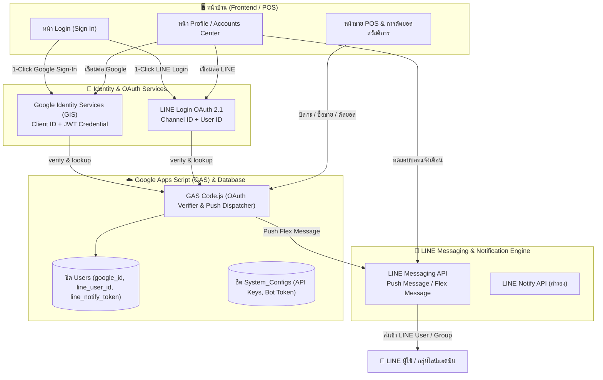

# แผนการพัฒนา: ระบบ Google Sign-In, LINE Login และ LINE Bot แจ้งเตือนอัตโนมัติ

> **ไฟล์แผนงาน:** `docs/superpowers/plans/2026-09-11-google-oauth-line-login-and-line-bot-notifications.md`  
> **เป้าหมาย:** พัฒนาระบบเชื่อมต่อภายนอก (Third-Party Identity & Bot Integration) แบบครบวงจร:
> 1. 🌐 **Google Sign-In (Google OAuth 2.0 / GIS):** เชื่อมต่อบัญชี Google และล็อกอิน 1-Click โดยไม่ต้องจำรหัสผ่าน
> 2. 💬 **LINE Login (LINE OAuth 2.1 / LIFF):** เชื่อมต่อบัญชี LINE และล็อกอินเข้าสู่ระบบผ่านแอป LINE
> 3. 🤖 **LINE Official Account & Messaging API Bot (ระบบบอทแจ้งเตือนอัตโนมัติ):**
>    - ส่งการแจ้งเตือนยอดขายรายวัน (Daily Sales Summary)
>    - ส่งใบเสร็จดิจิทัล (Flex Message E-Receipt)
>    - ส่งสรุปการตัดยอดสวัสดิการประจำเดือน (Monthly Deductions Report)
>    - แจ้งเตือนความปลอดภัย (Security Alerts)
> 4. ⚙️ **ระบบจัดการ API Credentials & QR Code เพิ่มเพื่อนบอท:** ตั้งค่า Client ID, Channel Access Token และ QR Code เพิ่มเพื่อนในหน้าโปรไฟล์/ตั้งค่าระบบ

---

## 1. สถาปัตยกรรมการทำงาน (Architecture & Flow)



---

## 2. โครงสร้างข้อมูลและค่าคอนฟิก (Data Schema)

### 2.1 ตาราง `Users` (รองรับการผูกบัญชี)
| Column | Field Name | Type | Description |
|---|---|---|---|
| Col 1 | `user_id` | string | `USR-01`, `USR-02` (Primary Key) |
| Col 2 | `username` | string | ชื่อผู้ใช้งาน |
| Col 3 | `password_hash` | string | รหัสผ่านหลัก |
| Col 4 | `pin_hash` | string | รหัส PIN 4-6 หลัก |
| Col 5 | `full_name` | string | ยศ-ชื่อ-สกุล |
| Col 6 | `role` | string | `ADMIN` / `STAFF` / `SELLER` |
| Col 7 | `seller_id` | string | รหัสร้านค้า (ถ้าเป็น SELLER) |
| Col 8 | `avatar_url` | string | URL รูปโปรไฟล์ |
| Col 9 | `email` | string | อีเมล (ผูกกับ Google Account) |
| Col 10 | `google_id` | string | Google Sub / Account ID |
| Col 11 | `line_user_id` | string | LINE User ID (`Uxxxxxxxx...`) |
| Col 12 | `line_notify_token` | string | LINE Notify Token หรือ Bot Sub Token |
| Col 13 | `is_active` | boolean | สถานะการใช้งาน |

### 2.2 คอนฟิกส่วนกลาง (`System_Configs` หรือ `localStorage` / Env)
```typescript
export interface IntegrationConfigs {
  google_client_id?: string;         // Google OAuth 2.0 Client ID
  line_login_channel_id?: string;    // LINE Login Channel ID
  line_bot_channel_token?: string;   // LINE Messaging API Channel Access Token (Long-lived)
  line_bot_basic_id?: string;        // LINE Official Account ID (เช่น @pxwing21)
  line_bot_qr_url?: string;          // URL รูปภาพ QR Code สำหรับสแกนเพิ่มเพื่อน
  auto_notify_daily_sales: boolean;  // ส่งสรุปยอดขายอัตโนมัติเมื่อปิดกะ
  auto_notify_deductions: boolean;   // ส่งแจ้งเตือนเมื่อตัดยอดเงินเดือนสวัสดิการ
}
```

---

## 3. แผนงานการพัฒนาแบบเป็นขั้นตอน (Step-by-Step Execution Plan)

### 🟢 Task 1: Backend GAS Integration & LINE Push Notification Handlers
**ไฟล์เป้าหมาย:** `backend/gas/Code.js`
- **สิ่งที่ต้องทำ:**
  1. **Google Login Verification:**
     - เพิ่มฟังก์ชัน `handleGoogleLogin(credential, googleId, email)` ตรวจสอบ `google_id` หรือ `email` ในชีต `Users` และคืนค่าข้อมูลผู้ใช้ `AuthUser`
  2. **LINE Login Verification:**
     - เพิ่มฟังก์ชัน `handleLineLogin(lineUserId, lineProfile)` ค้นหา `line_user_id` ในชีต `Users` และคืนค่า session ผู้ใช้
  3. **LINE Messaging API Push Message Dispatcher:**
     - เพิ่มฟังก์ชัน `handleSendLinePushNotification(payload)` โดยใช้ `UrlFetchApp.fetch('https://api.line.me/v2/bot/message/push')`
     - รองรับทั้งข้อความธรรมดา (Text Message) และ **Flex Message** (การ์ดสรุปยอดขายสวยงาม, ใบเสร็จ, แจ้งเตือนสวัสดิการ)
  4. **LINE Notify API Dispatcher:**
     - เพิ่มฟังก์ชัน `handleSendLineNotify(token, message)` สำรองสำหรับการแจ้งเตือนผ่าน Notify Token
  5. **Routing in `doPost` / `doGet`:**
     - Action: `googleLogin`, `lineLogin`, `sendLinePushNotification`, `sendLineNotifyTest`, `getIntegrationConfigs`, `saveIntegrationConfigs`

---

### 🟢 Task 2: Service Layer & SDK Integrations
**ไฟล์เป้าหมาย:**
- `src/services/googleAuthService.ts` (สร้างใหม่)
- `src/services/lineAuthService.ts` (สร้างใหม่)
- `src/services/lineBotService.ts` (สร้างใหม่)
- `src/core/api.ts`

- **สิ่งที่ต้องทำ:**
  1. `googleAuthService.ts`:
     - โหลด Google Identity Services script (`https://accounts.google.com/gsi/client`) แบบ dynamic
     - ฟังก์ชัน `initGooglePrompt(onSuccess, onError)`
     - ฟังก์ชัน `triggerGoogleSignIn(): Promise<{ google_id: string; email: string; name: string; avatar: string }>`
  2. `lineAuthService.ts`:
     - ฟังก์ชัน `triggerLineLogin(channelId): Promise<{ line_user_id: string; display_name: string; picture_url: string }>`
     - จัดการ Redirect / Popup Callback และดึง LINE User ID
  3. `lineBotService.ts`:
     - ฟังก์ชันสร้าง Flex Message Template สำหรับ:
       - 🧾 **E-Receipt Flex:** สรุปรายการสินค้าและยอดเงิน
       - 📊 **Daily Sales Flex:** ยอดขายประจำวัน กำไร และยอดเครดิตสวัสดิการ
       - 💰 **Payroll Deduction Flex:** รายงานสรุปการหักหนี้/สวัสดิการประจำเดือน
     - ฟังก์ชันส่งข้อความทดสอบ `testLineBot(targetUserId, message)`
  4. `src/core/api.ts`:
     - เชื่อมโยง API methods: `googleLogin()`, `lineLogin()`, `sendLinePush()`, `sendLineNotifyTest()`

---

### 🟢 Task 3: Login View (ปุ่ม 1-Click Google Sign-In & LINE Login)
**ไฟล์เป้าหมาย:** `src/features/auth/LoginView.tsx`
- **สิ่งที่ต้องทำ:**
  1. เพิ่มปุ่ม **"Sign in with Google"** (ปุ่มดีไซน์มาตรฐาน Google พร้อมโลโก้ G)
  2. เพิ่มปุ่ม **"เข้าสู่ระบบด้วย LINE"** (ปุ่มสีเขียว LINE `#06C755` พร้อมโลโก้ LINE)
  3. เพิ่มเส้นคั่น "หรือเข้าสู่ระบบด้วยบัญชีผู้ใช้ (OR)" สวยงามระดับมืออาชีพ
  4. เมื่อผู้ใช้กดล็อกอินด้วย Google / LINE:
     - เปิด Popup ยืนยันตัวตน
     - นำ credential ไปเช็คกับระบบ
     - หากพบผู้ใช้ที่ผูกบัญชีไว้ -> นำเข้าสู่ระบบทันที (Success Toast)
     - หากยังไม่ได้ผูกบัญชี -> แสดงข้อความแจ้งเตือน "ยังไม่พบบัญชีที่ผูกกับ Google/LINE นี้ กรุณาเข้าสู่ระบบด้วย Username/Password เพื่อผูกบัญชีในหน้าตั้งค่าก่อน"

---

### 🟢 Task 4: Profile Tab & Accounts Center Enhancements
**ไฟล์เป้าหมาย:** `src/features/admin/components/ProfileTab.tsx`
- **สิ่งที่ต้องทำ:**
  1. **หมวดหมู่ที่ 3: บัญชีที่เชื่อมต่อสำหรับล็อกอิน (Connected Accounts):**
     - ปุ่ม **"🔗 เชื่อมต่อบัญชี Google ทันที"** (เรียก `triggerGoogleSignIn` บันทึก `google_id` และ `email` จริง)
     - ปุ่ม **"💬 เชื่อมต่อบัญชี LINE ทันที"** (เรียก `triggerLineLogin` บันทึก `line_user_id` จริง)
     - สถานะแสดงเป็น ✅ "เชื่อมต่อแล้ว (พร้อมเข้าสู่ระบบ 1-Click)"
  2. **หมวดหมู่ที่ 4: การแจ้งเตือนผ่าน LINE & บอท (LINE Alerts & Bot):**
     - แสดง **QR Code และลิงก์ Add Friend** ของ LINE Official Account ของระบบ
     - แสดงช่องระบุ **LINE User ID** และ **LINE Notify Token**
     - ปุ่ม **"🔔 ส่งข้อความทดสอบเข้า LINE บอท"** (ส่งการ์ด Flex Message ทดสอบจริงเข้าบัญชี LINE ของผู้ใช้)
     - สวิตช์เปิด/ปิดการรับแจ้งเตือน:
       - สรุปยอดขายรายวัน
       - แจ้งเตือนการตัดยอดสวัสดิการ
       - แจ้งเตือนความปลอดภัย

---

### 🟢 Task 5: Integration Settings & API Keys Panel (สำหรับ Master Admin)
**ไฟล์เป้าหมาย:** `src/features/admin/components/IntegrationSettingsModal.tsx` (หรือรวมใน Settings)
- **สิ่งที่ต้องทำ:**
  1. โมดอล/หน้าต่างสำหรับผู้ดูแลระบบตั้งค่า Key ส่วนกลาง:
     - `Google Client ID`
     - `LINE Login Channel ID & Channel Secret`
     - `LINE Messaging API Channel Access Token`
     - `LINE Official Account Basic ID / QR Code Link`
  2. มีคู่มือสั้นๆ (Step-by-step Guide) อธิบายวิธีไปเอา Key จาก Google Cloud Console และ LINE Developers Console

---

### 🟢 Task 6: Automatic Event Triggers (แจ้งเตือนเหตุการณ์จริง)
**ไฟล์เป้าหมาย:** `src/features/pos/PosView.tsx`, `src/features/admin/AdminView.tsx`, `backend/gas/Code.js`
- **สิ่งที่ต้องทำ:**
  1. **POS Shift Closing / Daily Report:** เมื่อปิดกะแคชเชียร์ -> ระบบเรียกบอทส่งสรุปยอดขายเข้ากลุ่มไลน์แอดมินหรือไลน์ส่วนตัว
  2. **Monthly Payroll Deductions Execution:** เมื่อกดประมวลผลตัดยอดสวัสดิการประจำเดือนสำเร็จ -> ระบบส่งรายงานสรุปเข้า LINE
  3. **High-Value Order Alert:** แจ้งเตือนเมื่อมียอดขายหรือการเติมเงินพิเศษ

---

## 4. มาตรการตรวจสอบและความปลอดภัย (Verification & Quality Gates)

1. **Verification Command Invariant:**
   ```bash
   npx tsc --noEmit && node -c backend/gas/Code.js
   ```
   ต้องผ่าน 0 errors เสมอ
2. **ความปลอดภัยของข้อมูล (Security Invariants):**
   - รหัสผ่าน (`password_hash`) และ PIN ไม่ถูกเปิดเผยใน token
   - บัญชี `USR-01` (Master Admin) ได้รับการปกป้องเสมอ
   - รองรับโหมด Local Mocking หากยังไม่มี API Key จริง (จำลองการทำงานได้ 100% ไม่พัง)
